It's almost 2020, and browsers can do amazing stuff.  

This repo contains a non-exhaustive list of less-known features implemented in browsers **today**.

This list isn't intended for a technical audience; instead it wants to be a "I don't know we could that in a browser" list.

In many cases, listed features aren't yet part of the standard, and may only be available on certain browsers or configurations.

---

## [prefers-color-scheme](https://developer.mozilla.org/en-US/docs/Web/CSS/@media/prefers-color-scheme)
Many OS provides light or dark color theme (notably dark mode on macOS), websites can detect the preferred color scheme.

---

## [prefers-reduced-motion](https://developer.mozilla.org/en-US/docs/Web/CSS/@media/prefers-reduced-motion)
Similarly to dark mode, users in their OS can remove/reduce animations, we can also detect that.

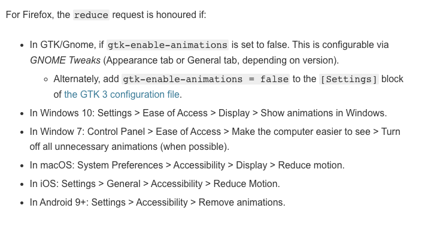

---

## [Payment Request API](https://developers.google.com/web/fundamentals/payments)
You can process payments delegating the browser. If configured, the UI will be autofilled with your credit card, shipping info and whatnot.

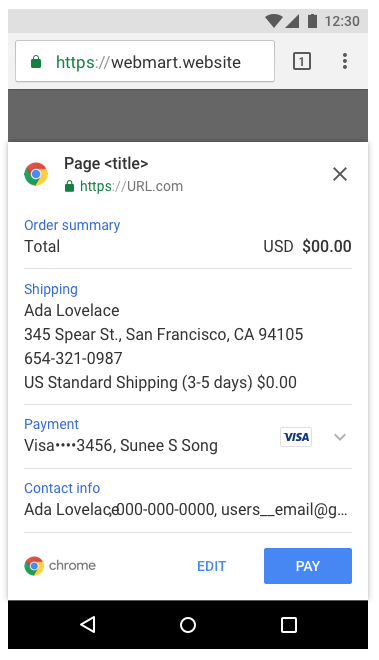
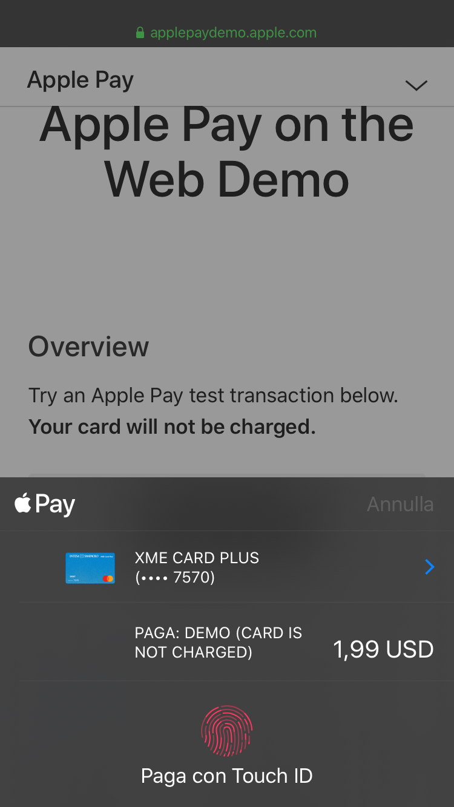

---

## [Web Share API](https://web.dev/web-share/)
Delegate the share of URLs or files to the OS, providing share options based on the installed apps and user preference.

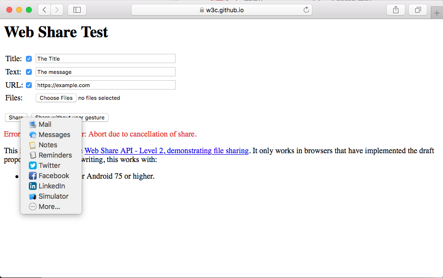
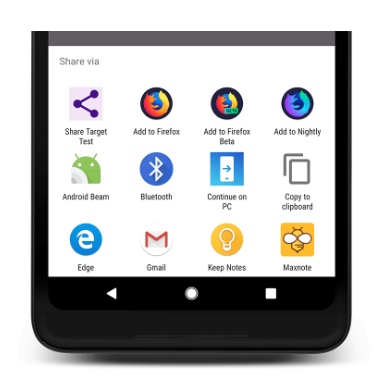

---

## [Push API](https://developer.mozilla.org/en-US/docs/Web/API/Push_API)
Browsers can register push notifications. Sending later, at any moment push notifications, those notifications can contain images, buttons and inline replies.

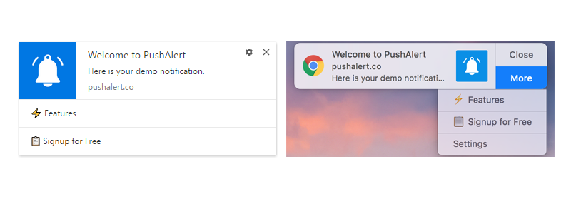

---

## [Service Workers](https://developers.google.com/web/fundamentals/primers/service-workers)
Among other features, service workers can enable offline browsing and background tasking.

Example:
- Provide a fallback when internet isn't available
- Sending a form when internet isn't available will result in data lost, service worker can be used to save those data and send them later when an internet connection is up again

---

## [Web/native app install banners](https://developers.google.com/web/fundamentals/app-install-banners)
Display a native banner to encourage users to add the app/website on the home or to install a native app.

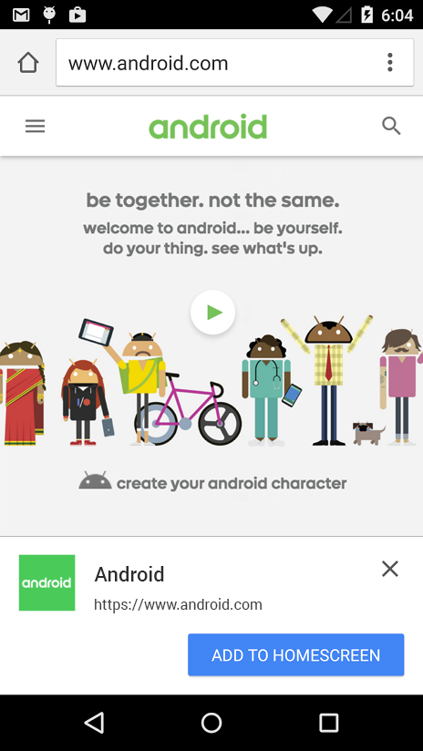

---

## [Get Installed Related Apps API](https://web.dev/get-installed-related-apps/)
Check if the native app related to your site is already installed.

---

## [WebXR](https://developer.mozilla.org/en-US/docs/Web/API/WebXR_Device_API)
Allows to tun VR/AR on the web.

---

## [Picture-in-Picture (PiP)](https://developers.google.com/web/updates/2018/10/watch-video-using-picture-in-picture)
Consent to play a video and detach it from the current page, staying sticky and always visible.

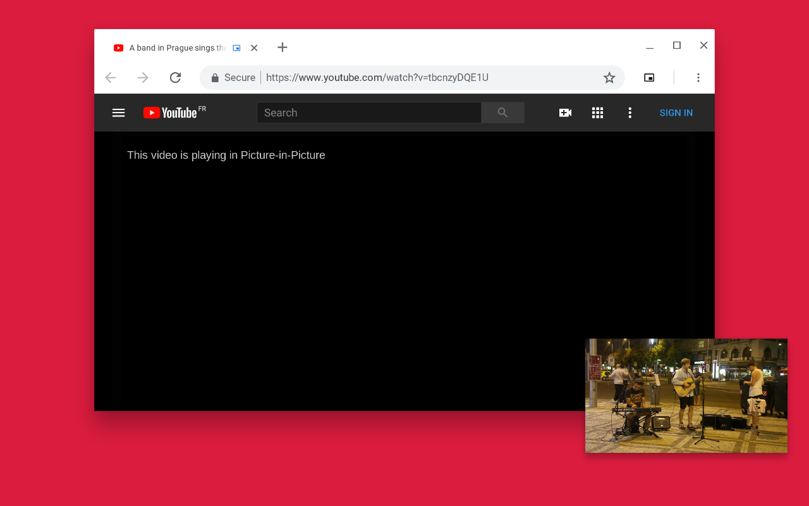

---

## [Media Session API](https://developers.google.com/web/updates/2017/02/media-session)
Customize media notifications by providing metadata and actions.

---

## [Chrome Sender API](https://developers.google.com/cast/docs/developers)
If chromecast is available, you can stream a video/audio to your TV / Chromecast enabled device.

---

## [AirPlay](https://developer.apple.com/documentation/webkitjs/adding_an_airplay_button_to_your_safari_media_controls)
Consent to stream a media over AirPlay (like AppleTV)

---

## [Force Touch API](https://developer.apple.com/library/archive/documentation/AppleApplications/Conceptual/SafariJSProgTopics/RespondingtoForceTouchEventsfromJavaScript.html)
With some Apple-specific hardware (like iPhone6S+ and Magic Trackpad) you can detect force pressure.

---

## [AR Quick Look](https://developer.apple.com/augmented-reality/quick-look/)
On iOS you can display an .usdz 3D asset using a native AR UI

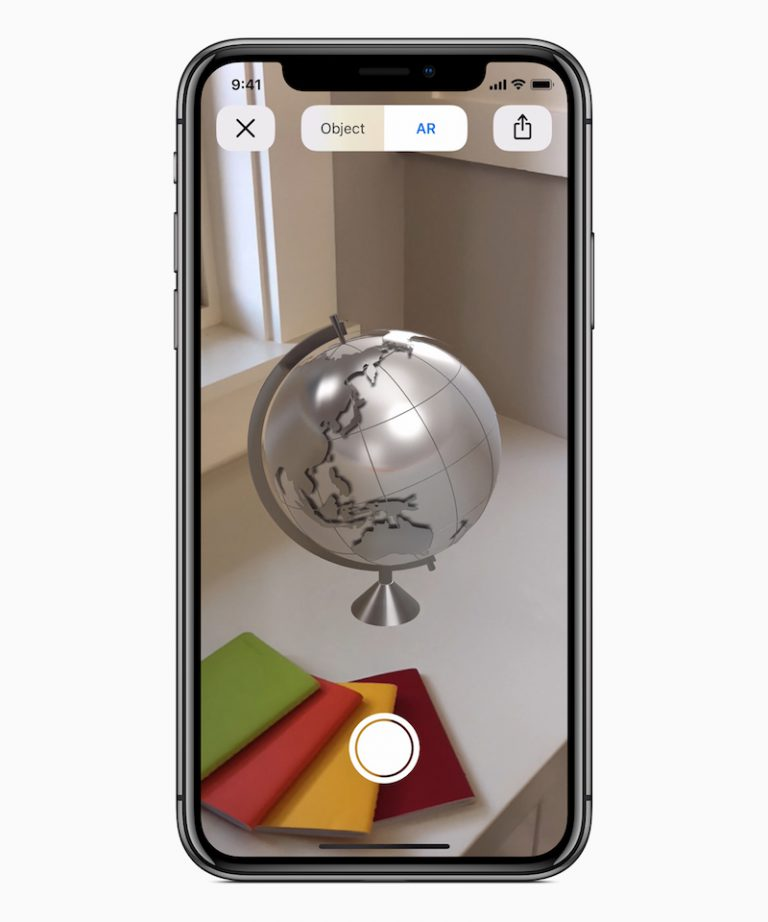

---

## [GamePad API](https://developer.mozilla.org/en-US/docs/Web/API/Gamepad_API)
Allows to use a physical gamepad.

---

## [WebUSB API](https://developers.google.com/web/updates/2016/03/access-usb-devices-on-the-web)
Allows to access and use peripherals connected via USB.

---

## [Web Bluetooth API](https://developers.google.com/web/updates/2015/07/interact-with-ble-devices-on-the-web)
Allows to access and use bluetooth devices.

---

## [Web Locks API](https://developer.mozilla.org/en-US/docs/Web/API/Web_Locks_API)
Prevent display sleep and enable wake lock.

---

## [Keyboard Lock](https://developer.mozilla.org/en-US/docs/Web/API/Keyboard/lock)
While in fullscreen, allows to receive keys that are normally handled by the system or the browser like Cmd/Alt-Tab, or Esc.

---

## [Generic Sensor API](https://developers.google.com/web/updates/2017/09/sensors-for-the-web)
Allows to use several sensors like Accelerometer, Gyroscope, AmbientLightSensor, Magnetometer

---

## [Credential Management API](https://developers.google.com/web/fundamentals/security/credential-management/)
Enables to store and retrieve password credentials, it elso enables tap to sign in and automatic sign back, password sharing on multiple device and many more.

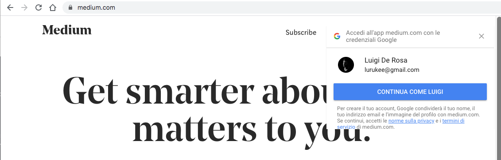

---

## [Clipboard API](https://developer.mozilla.org/en-US/docs/Web/API/Clipboard_API)
Allow to read and write text and images into the OS clipboard buffer

---

## [Presentation API](https://developer.mozilla.org/en-US/docs/Web/API/Presentation_API)
Gives ability to access external presentation-type displays and use them for presenting web content.

---

## [Screen Orientation API](https://www.w3.org/TR/screen-orientation/)
Read and lock screen orientation

---

## [getUserMedia camera selection](https://paul.kinlan.me/pixel-4xl-infrared-sensor-via-getusermedia/)
When using camera/microphone, we can select the input source (example front or back camera). On the Pixel 4XL we can even access the infrared camera (used for face detection).

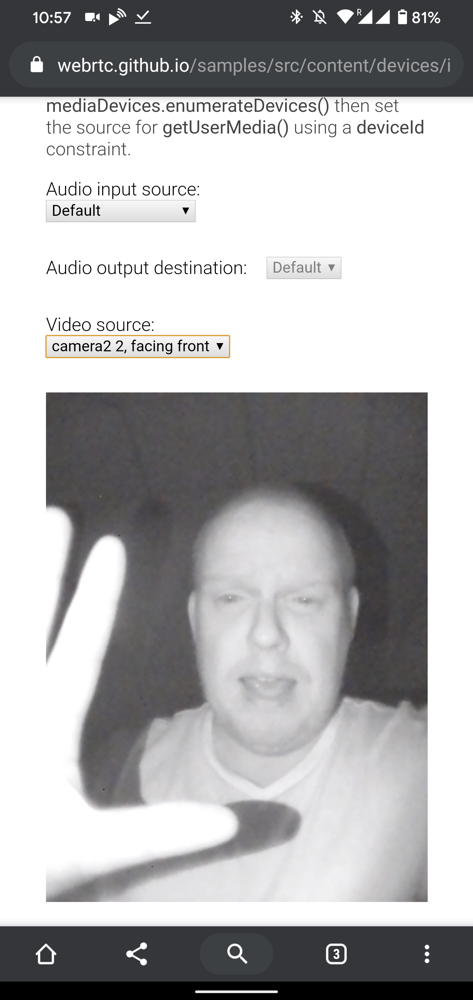

---

## [Pointer Lock (Mouse Lock)](https://developer.mozilla.org/en-US/docs/Web/API/Pointer_Lock_API)
Gives access to raw mouse movement, locks the target of mouse events to a single element, eliminates limits of how far mouse movement can go in a single direction, and removes the cursor from view. Obvious use cases are for first person or real time strategy games.

---

## [Theme Color](https://developers.google.com/web/updates/2014/11/Support-for-theme-color-in-Chrome-39-for-Android)
on Android you can customise tab color.

---

## [Vibration API](https://developer.mozilla.org/en-US/docs/Web/API/Vibration_API)
Provides access to the vibration mechanism of the hosting device.

---

## [Web Coffee API](https://iamjustjoking.com)
Use covfefe protocol to start coffee machines.

---

## [Battery Status API](https://developer.mozilla.org/en-US/docs/Web/API/Battery_Status_API#Browser_compatibility)
Allows access to see the battery level of the device's battery.

---

## [Page Visibility API](https://developer.mozilla.org/en-US/docs/Web/API/Page_Visibility_API)
Provides an API to ask whether the current tab is visible or not.

---

## [Web Speech API](https://developer.mozilla.org/en-US/docs/Web/API/Web_Speech_API/Using_the_Web_Speech_API)
Enables web developers to incorporate speech recognition and speech synthesis.

---

# Stuff under Origin Trial

## [Native File System](https://web.dev/native-file-system/)
Allows access to the file system.

---

## [SMS Receiver API](https://web.dev/sms-receiver-api-announcement/)
Allow the site to read received SMS, for example for OTP and phone number validation.

---

## [Contacts API](https://chromestatus.com/features/6511327140904960)
Provide native UI to select contacts from your OS and retrieve informations.

---

## [Badging API](https://web.dev/badging-api/)
Allows to set badge in OS in places like shelf or homescreen.

---
